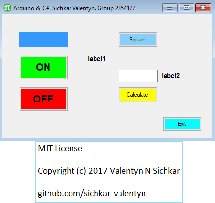

# C Sharp Windows Form data transceiver
C# program to communicate with Arduino

### Reference to:
[1] Valentyn N Sichkar. C# program to communicate with Arduino // GitHub platform [Electronic resource]. URL: https://github.com/sichkar-valentyn/C_Sharp_Windows_Form_data_transceiver (date of access: XX.XX.XXXX)

## Description
Using SerialPort and programming language C#, the program to communicate with Arduino board was created. The results of the working program are shown below on the figure.
The open-source Arduino Software (IDE) makes it easy to write code and upload it to the board.
The simplest sketche we have implemented is attached to the project.

## C Sharp Windows Form data transceiver

## MIT License
## Copyright (c) 2017 Valentyn N Sichkar
## github.com/sichkar-valentyn
### Reference to:
[1] Valentyn N Sichkar. C# program to communicate with Arduino // GitHub platform [Electronic resource]. URL: https://github.com/sichkar-valentyn/C_Sharp_Windows_Form_data_transceiver (date of access: XX.XX.XXXX)
